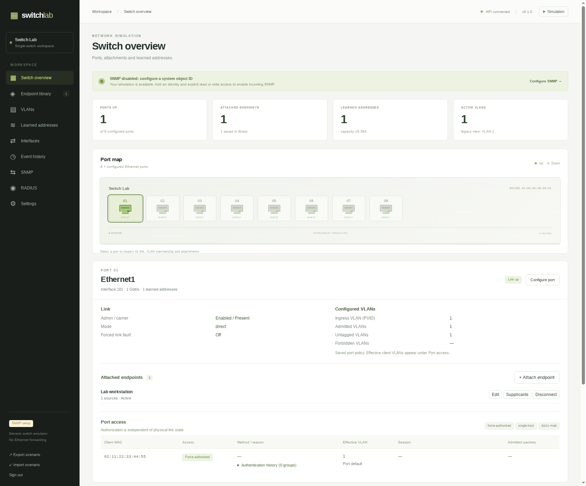

# Switch Lab

An SNMP switch simulator with a web UI for ports, endpoints, VLANs, MAC learning, and RADIUS access. It simulates switch management state without forwarding Ethernet frames.



## Run with Docker

Create the encryption key, then start the application from this directory:

```powershell
# Windows PowerShell
.\scripts\init-key.ps1
docker compose up --build -d
```

```sh
# Linux/macOS (requires OpenSSL)
sh scripts/init-key.sh
docker compose up --build -d
```

Open **http://localhost:8000** and create the administrator password. Later visits use that password; there are no default credentials. Configuration persists in the `switchlab-data` volume. Restoring it requires both the database and `secrets/config.key`.

Compose publishes TCP 8000 and UDP 161 on localhost by default. For LAN access, create `.env` beside `compose.yaml` with an IPv4 address assigned to the host, then run `docker compose up -d` again:

```dotenv
SWITCHLAB_BIND_ADDRESS=192.168.1.50
SWITCHLAB_HTTP_PORT=8000
```

Replace the example address, then open `http://HOST_LAN_ADDRESS:8000` from another device. `SWITCHLAB_HTTP_PORT` changes the web port; `SWITCHLAB_BIND_ADDRESS` applies to both published protocols. Connectivity depends on the host firewall and routing. HTTP is unencrypted; HTTPS can be provided by a reverse proxy.

SNMP starts disabled with no advertised object identity. Configure it in **SNMP** using the [identity and listener setup guide](specification/docs/IDENTITY_SETUP.md). To use a port other than 161, select the same listener port in the UI and `SWITCHLAB_SNMP_PORT` in `.env`, then recreate the container with `docker compose up -d`. A higher port such as 1161 is available when the host cannot publish 161.

### Native alternative

Python 3.12+ is required. The compiled UI is included. Activate the virtual environment for your shell, then run one application worker:

```sh
python -m venv .venv
# Windows: .venv\Scripts\activate
# Linux/macOS: . .venv/bin/activate
python -m pip install .
python scripts/init.py
python -m uvicorn switchlab.api:app --host 127.0.0.1 --port 8000 --workers 1
```

For native LAN access, use the host's LAN address with `--host`. EAP-TLS and PEAP require the managed Linux helper included in Docker; Python-only native installs support MAB. See the [RADIUS setup guide](specification/docs/RADIUS.md). Native data and key paths default to `data/switch.db` and `secrets/config.key`; both are required to restore saved configuration.

## Documentation

- [Setup and identity](specification/docs/IDENTITY_SETUP.md)
- [RADIUS access, accounting, and dynamic authorization](specification/docs/RADIUS.md)
- [API schema](docs/openapi.json); interactive documentation is at `/docs` on the running instance.
- [Technical specification](specification/TECHNICAL_SPECIFICATION.md) and [supported MIB objects](specification/docs/mib-coverage.csv)
- [Executed validation](docs/VALIDATION.md) and [formal models and checks](specification/README.md)

## License

Original code, documentation, models, and project assets use the [MIT License](LICENSE). Dependencies retain their upstream licenses. Native EAP inputs and notices are in `runtime/eap/` and ship in Docker at `/usr/local/share/doc/eapol_test`. [Third-party notices](ui/public/assets/THIRD_PARTY_NOTICES.txt) also ship with the packaged UI at `/assets/THIRD_PARTY_NOTICES.txt`.
